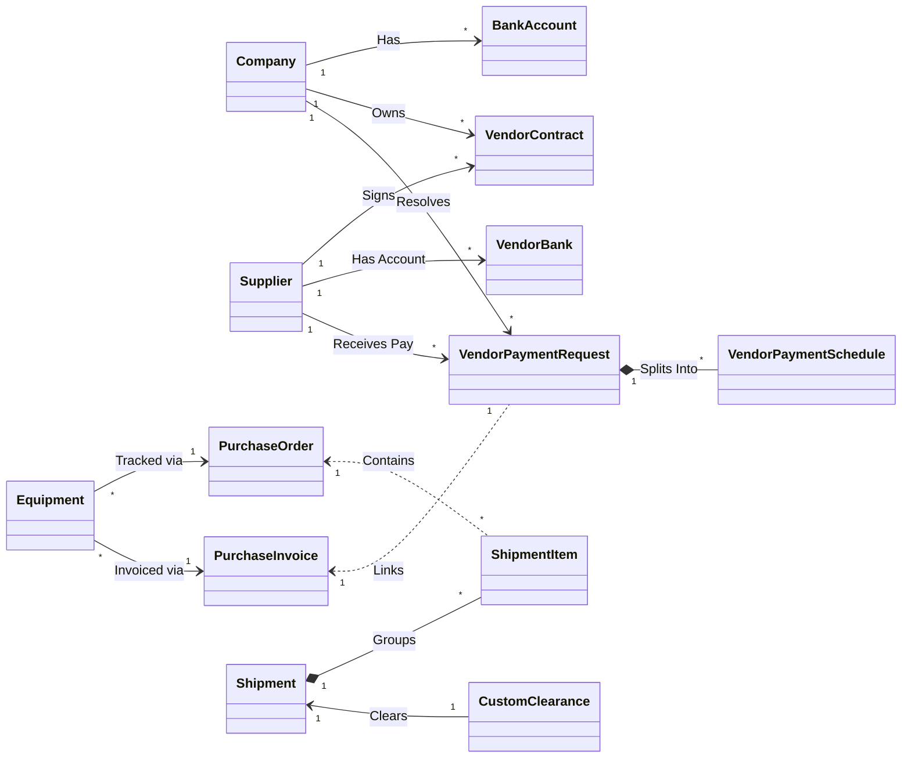
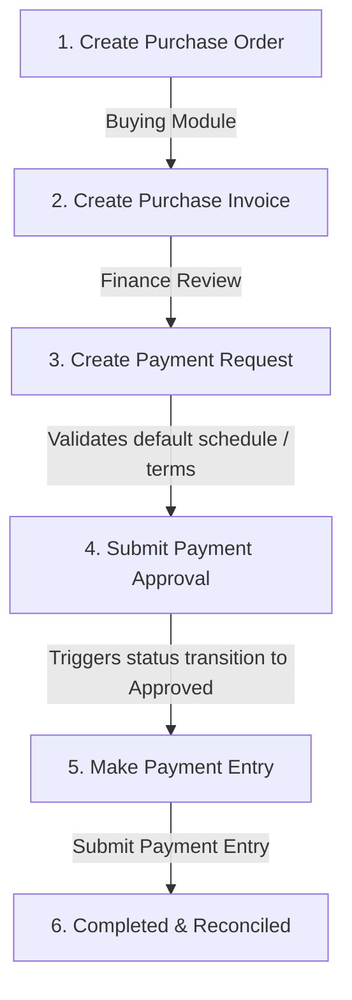

# Developer & System Administration Documentation
## Sarveksha Vendor Application (v16)

This document provides a technical walkthrough of how the **Sarveksha Vendor** application operates, details its entities and data relationships, and outlines the structural architecture designed for seamless scalability.

---

## 1. System Overview

The `sarveksha_vendor` custom application provides a **Vendor Payment Tracking** module. It supports a multi-company organizational framework spanning multiple jurisdictions and currencies, establishing a robust foundation for future logistics, customs clearance, procurement, asset management, and financial reporting.

---

## 2. Architecture & Data Model

The application interfaces directly with ERPNext's standard modules (Accounts, Stock, Buying) and introduces custom DocTypes tailored for tracking and workflows.

### Core Custom DocTypes:
1. **Vendor Contract (`Vendor Contract`)**: Represents legal agreements with suppliers. Stores validation rules, value limits, active periods, and default payment terms.
2. **Vendor Payment Request (`Vendor Payment Request`)**: Tracks payment demands tied to a specific `Purchase Invoice` or schedule.
3. **Vendor Payment Schedule (`Vendor Payment Schedule` - Child Table)**: Splits request values into scheduled terms (e.g., 25% Advance, 75% Delivery).
4. **Equipment (`Equipment`)**: Capital asset tracking directly associated with a `Purchase Order` and `Purchase Invoice`.
5. **Shipment (`Shipment`)**: Tracks logistical details (Carrier, BOL, origin, destination).
6. **Shipment Item (`Shipment Item` - Child Table)**: Detailed breakdown of parts/materials in transit.
7. **Custom Clearance (`Custom Clearance`)**: Manages duties, brokers, clearance dates, and status.
8. **Vendor Bank (`Vendor Bank`)**: Stores validated vendor bank details (IBAN, SWIFT, branch).
9. **Payment Approval (`Payment Approval`)**: Holds history of managers' comments and approvals.
10. **Payment Batch (`Payment Batch`)**: Aggregates payment items to pay them via a single bank instruction.
11. **Intercompany Transfer (`Intercompany Transfer`)**: Manages transactions and balance settlements between entities.

---

## 3. Workflow Flowchart

The system automates validation and handoffs across departments:

1. **Purchase Order**: Created by the Purchase Manager.
2. **Purchase Invoice**: Booked by the Accounts Officer against the Purchase Order.
3. **Finance Review**: The System/Organization Admin initiates a `Vendor Payment Request`. The system pulls terms from the `Vendor Contract` and auto-populates the schedule.
4. **Approval**: The Finance Manager reviews the request and inserts a `Payment Approval` record. The status shifts to `Approved`.
5. **Payment Entry**: The Accounts Officer clicks "Make Payment Entry" from the Request screen. The whitelisted Python API map generates a standard ERPNext `Payment Entry` document in draft status.
6. **Completed**: Once submitted, the ledger updates, and the request status changes to `Paid`.

---

## 4. Multi-Company & Localized Settings

The application handles localized configurations natively:

| Company Name | Local Country | Currency | Custom Tax Rate | Default Bank Account |
| :--- | :--- | :--- | :--- | :--- |
| **Sarveksha Realty and Inframine LLP** | India | INR | GST 18% + TDS | HDFC Bank, ICICI Bank |
| **Globe Multitrade and Service LLC** | UAE | AED | VAT 5% | Emirates NBD, Mashreq Bank |
| **Sarveksha BSTP SAS** | Guinea | GNF | VAT 18% | Ecobank Guinea |
| **Sarveksha Mining SARL** | Cameroon | XAF | VAT 19.25% | Afriland First Bank |
| **Sarveksha Botswana Proprietary Ltd** | Botswana | BWP | VAT 14% | First National Bank Botswana |
| **Odhav Holdings** | Sierra Leone | SLE | GST 15% | Rokel Commercial Bank |

---

## 5. Scalability Path

The architecture is explicitly decoupled to allow easy scaling:

### A. Scaling Procurement & Logistics
* **Shipment & Items**: Expand `Shipment` to store weights, dimensions, and carriers. The `Shipment Item` links directly to ERPNext's `Purchase Receipt Item`, allowing automated receipt creation upon delivery.
* **Customs Integration**: The `Custom Clearance` model can connect to API registries of port authorities or logistics brokers to import customs status updates via webhooks.

### B. Scaling Asset & Equipment Management
* **Auto Asset Creation**: Extend `Equipment` controllers to automatically create standard ERPNext `Asset` records in the Fixed Asset module when a shipment of status "Delivered" is saved.

### C. Scaling Banking and Liquidity
* **Payment Gateways**: Integrate the `Payment Batch` DocType with bank host-to-host connectivity or payment APIs (e.g., SWIFT, local banks) to execute batch transfers directly from the ERP Desk.
