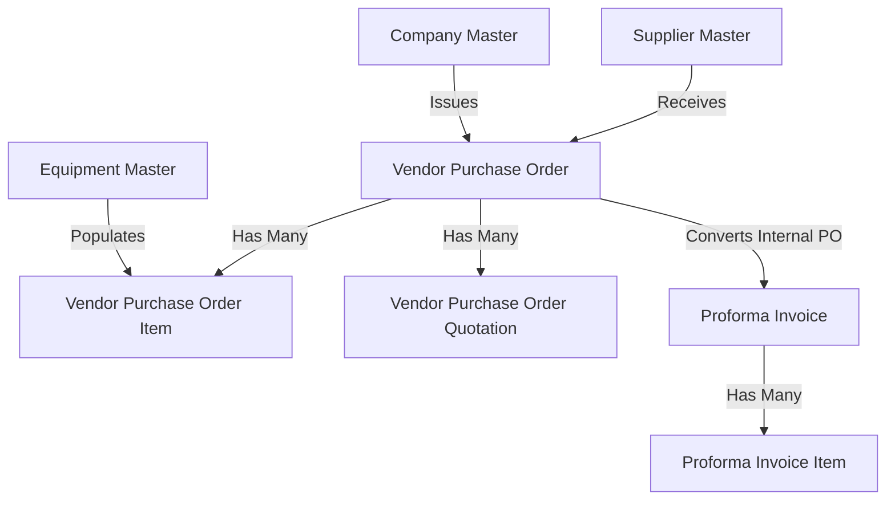
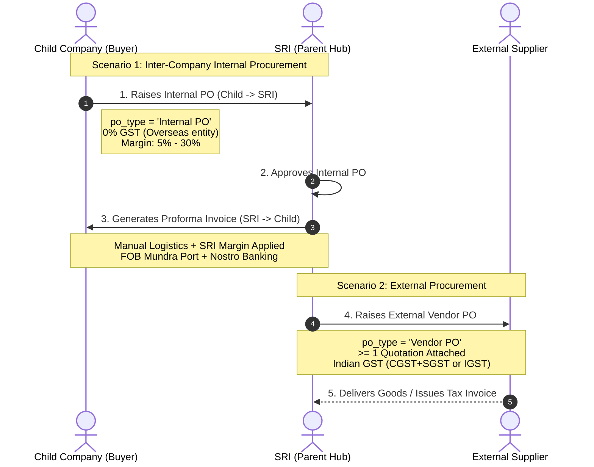
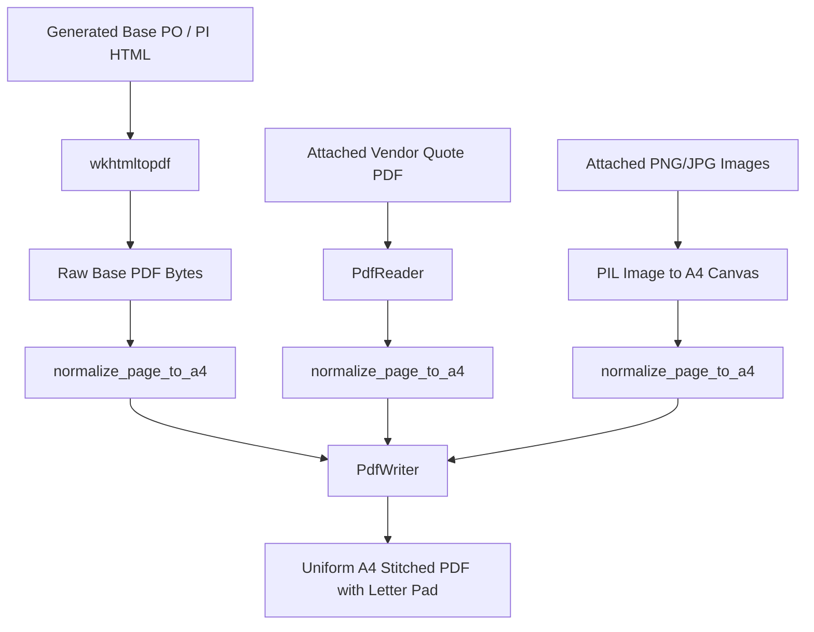

# Sarveksha ERP — Technical Overview & Architecture

This document provides a comprehensive technical overview of the Sarveksha ERP procurement and inter-company supply chain module. It is intended for software engineers, tech leads, system architects, and DevOps personnel.

---

## 1. System Architecture & Tech Stack

- **Framework**: [Frappe Framework v15](https://frappeframework.com/) (Python / JavaScript full-stack meta-framework).
- **ERP Suite**: [ERPNext v15](https://erpnext.com/) (Standard modules: Buying, Selling, Stock, Accounts).
- **Custom Application**: `sarveksha_erp` (installed under `apps/sarveksha_erp`).
- **Runtime & Environment**:
  - **Python**: 3.14+ in virtual environment (`frappe-bench/env`).
  - **Node.js**: Node 18+ / Yarn for frontend asset compilation.
  - **Database**: MariaDB 10.6+ / MySQL compatible.
  - **In-Memory Caching & Background Queues**: Redis Cache (Port 13000), Redis Queue (Port 11000).
  - **Web / WSGI Server**: Werkzeug / Gunicorn via Frappe Bench HTTP server (Port 8000).
  - **PDF Generation Engine**: `wkhtmltopdf` combined with `pdfkit` and Python `pypdf` + `Pillow` (PIL).

---

## 2. DocType Hierarchy & Data Models

### 2.1. Core Transactional DocTypes



#### A. `Vendor Purchase Order` (`vendor_purchase_order`)
The central document for all procurement transactions:
- **Submittable DocType**: Progresses through Draft (`docstatus = 0`), Submitted/Approved (`docstatus = 1`), and Cancelled (`docstatus = 2`).
- **PO Types (`po_type`)**:
  1. `Vendor PO` (External procurement): An entity orders goods/equipment directly from a 3rd-party vendor.
  2. `Internal PO` (Inter-company procurement): An overseas Child Company orders equipment through **Sarveksha Realty and Inframine LLP (SRI)** in India.
- **Reference Number Engine (`ref_number`)**: Unique sequential identifier generated on final approval (separate from Frappe's autoincrement document `name`). Handles revisions with `-1`, `-2` suffixes.
- **Quotation Governance**: Governs external vendor quotes via child table `Vendor Purchase Order Quotation`. At least 1 valid quotation with attached file is strictly required.

#### B. `Vendor Purchase Order Item` (`vendor_purchase_order_item`)
Child table holding line-item equipment details:
- Fields: `equipment` (Link to Equipment), `equipment_name`, `hsn_code`, `brand`, `manufacturer`, `unit`, `quantity`, `rate`, `discount_percent`, `taxable_amount`, `gst_percentage`, `tax_amount`, `total_amount`, `specification`.
- Auto-syncs first item details to parent legacy fields for backward compatibility.

#### C. `Vendor Purchase Order Quotation` (`vendor_purchase_order_quotation`)
Child table recording competing vendor quotes:
- Fields: `supplier`, `quotation_reference`, `quotation_date`, `quotation_amount`, `quotation_pdf` (Direct visible upload button in table list view).

#### D. `Proforma Invoice` (`proforma_invoice`)
Export billing document generated exclusively from referenced Internal POs:
- Seller: Fixed to **Sarveksha Realty and Inframine LLP** (India).
- Buyer: Overseas Child Company (e.g. Odhav Holdings, SVB SL, Baani Minerals).
- Strictly references an `Internal PO` (cannot reference External POs).
- Enforces an SRI Margin between **5.0% and 30.0%**.
- Manual logistics cost entry (freight, insurance, packing, other charges).
- Encapsulates Indian banking and USD Nostro correspondent banking instructions.

#### E. `Proforma Invoice Item` (`proforma_invoice_item`)
Child table for PI line items:
- Fields: `equipment`, `item_description`, `make_model`, `hsn_code`, `unit`, `quantity`, `base_rate`, `amount`.

---

## 3. Data Flow & Inter-Company Procurement Lifecycle



---

## 4. Taxation & Child Company Business Logic

The system dynamically determines taxation rules inside `vendor_purchase_order.py` (`calculate_item_totals`) and `vendor_purchase_order.js`:

1. **Child Company Detection**:
   ```python
   is_child_company = not self._is_sri_entity(self.company)
   ```
   If the issuing company is NOT `Sarveksha Realty and Inframine LLP`, it is classified as an overseas Child Company.
2. **GST Stripping**:
   - `gst_percentage = 0.0`
   - `tax_amount = 0.0`
   - `gst_type = None`
   - Tax breakdown section is hidden in UI and omitted from print output.
3. **Indian Entity (SRI) Taxation**:
   - Intra-state (Supplier State Code == SRI State Code `27`): Splits tax 50/50 into `CGST` and `SGST`.
   - Inter-state (Supplier State Code != `27`): Applies full tax as `IGST`.
   - LUT Applicable (`is_lut_applicable = 1`): Sets `gst_type = "IGST"` at nominal `0.1%` export rate.

---

## 5. Role-Based Access Control (RBAC) & Security

The system enforces a strict 4-stage governance workflow:

| Role Name | User Account | Permitted Operations |
|---|---|---|
| **System Manager / Admin** | `Administrator` | Unrestricted configuration, overriding, migration, and system audit. |
| **PO Generator** | `po_generator@sarveksha.com` | Creates Draft POs, attaches quotations, edits line items, submits for verification. Blocked from self-verification and approval. |
| **PO Verifier** | `po_verifier@sarveksha.com` | Reviews Draft POs and quotation governance, performs technical verification, transitions to `Verified`. Blocked from creating POs and final approval. |
| **PO Approver** | `po_approver@sarveksha.com` | Final commercial and financial sign-off, approves PO, generates `ref_number`, executes legal digital signature. Blocked from creating POs. |

### Decommissioned Roles
- `Procurement Manager` (`procurement_manager@sarveksha.com`) has been **disabled**. All payment terms and percentage advance fields are directly accessible to authorized workflow roles without requiring a procurement manager.

### Security Guards in Code
- **Creation Blocking**: In `vendor_purchase_order.py`:
  ```python
  def validate_creation_roles(self):
      if self.is_new() and not self.flags.ignore_permissions:
          user_roles = frappe.get_roles()
          if "System Manager" not in user_roles and "PO Generator" not in user_roles:
              if any(r in user_roles for r in ("PO Verifier", "PO Approver")):
                  frappe.throw(_("Verifiers and Approvers are not permitted to create new Purchase Orders."))
  ```
- **Field Immutability**: Fields such as `company`, `vendor`, `po_type`, `items`, `taxable_value`, and `grand_total` are permanently locked once approved.

---

## 6. PDF Engine & Page Normalization Architecture

A critical architectural component is [pdf_handler.py](file:///home/umeshraj/erp/frappe-bench/apps/sarveksha_erp/sarveksha_erp/vendor_management/doctype/vendor_purchase_order/pdf_handler.py).

### The Problem
When purchasing equipment, vendors attach quotation PDFs, inspection certificates, and technical images of varying dimensions (Letter, Legal, landscape formats, multi-megapixel camera photos). Traditional stitching resulted in mismatched page sizes and viewer rendering crashes.

### The Solution: Standard A4 Normalization Engine


### Normalization Logic
```python
A4_WIDTH = 595.28   # 210mm in points
A4_HEIGHT = 841.89  # 297mm in points

def normalize_page_to_a4(page: PageObject) -> PageObject:
    orig_w = float(page.mediabox.width)
    orig_h = float(page.mediabox.height)
    if abs(orig_w - A4_WIDTH) < 1.0 and abs(orig_h - A4_HEIGHT) < 1.0:
        return page

    scale = min(A4_WIDTH / orig_w, A4_HEIGHT / orig_h)
    new_page = PageObject.create_blank_page(width=A4_WIDTH, height=A4_HEIGHT)
    t = Transformation().scale(scale).translate(tx, ty)
    new_page.merge_transformed_page(page, t)
    return new_page
```

---

## 7. Whitelisted Remote Procedure Calls (RPCs)

| Endpoint | File | Purpose |
|---|---|---|
| `get_supplier_payment_details` | `vendor_purchase_order.py` | Auto-fetches vendor GSTIN, PAN, bank details, and default payment terms. |
| `get_workflow_activity_history` | `vendor_purchase_order.py` | Fetches chronological workflow transition logs and comments for in-form audit trail. |
| `download_pdf` | `pdf_handler.py` | Overridden PDF download route that merges attachments and normalizes pages to A4. |
| `get_internal_po_details` | `proforma_invoice.py` | Fetches Internal PO details for populating a Proforma Invoice with zero auto-fetched logistics. |
| `create_proforma_invoice_from_internal_po` | `proforma_invoice.py` | Factory function to instantiate, validate, and save a PI directly from an Internal PO. |

---


## 8. Full-Page Stationery Background Architecture & Notify Party

### 8.1. Full-Page Stationery Background Overlay Architecture
In prior iterations, letterhead graphics were cropped to a top banner (`<div class="lh-header-crop">`) or squeezed into narrow image containers, which distorted corporate stationery and omitted the pre-printed company footers. Additionally, manual `'॥ श्री ॥'` text headers created unwanted artificial page breaks.

The modernized architecture completely reverts the manual `'॥ श्री ॥'` text headers and implements a full-page stationery background overlay:
1. **Stationery Assets**: Each company's high-resolution letterhead in `public/files` (`letterhead_sri_india.png`, `letterhead_botswana.jpeg`, etc.) is an exact A4 sheet containing both top corporate branding and bottom registered address/contact footers.
2. **Initial Background Application**: `pdf_handler.py` creates an exact standard A4 background page (`595.28 x 841.89 pt`) with the stationery image mapped 1:1 with zero distortion or squeezing.
3. **Data Overlaid**: The document content (tables, pricing, metadata, signatures) is rendered with a transparent background and dynamic top/bottom margins:
   - Dynamic top margin: `50mm` for standard headers (SRI, Sierra Leone, Guinea), `74mm` for Botswana and Cameroon Mining, and `80mm` for Baani Minerals to clear taller graphical logos.
   - Bottom margin: `22mm` across all templates to prevent overlapping the pre-printed company footer.
4. **Overlay Execution**: `pdf_handler.apply_stationery_background()` places the stationery page initially as the background canvas, then stamps the document content directly over it (`canvas.merge_page(bg); canvas.merge_page(content)`).
5. **Multi-Page & Attachment Isolation**: All document pages seamlessly inherit the corporate stationery background, while vendor quotations and technical inspection attachments appended to POs retain their authentic vendor formatting without background stamping.

### 8.2. Permanent Default Notify Party
- The Proforma Invoice permanently defaults the Notify Party coordinates to:
  ```
  Globe Multitrade & Service LLC
  Office No. 112, AL Jabri Building,
  Industrial Area, Sharjah (UAE)
  ```
  This is codified both in `proforma_invoice.py` (`set_parties_and_metadata` and `get_internal_po_details`) and in the HTML print format.

### 8.3. Baseline Data State Machine Distribution
The database contains 18 active Purchase Orders and 4 Proforma Invoices:
- **Internal POs (9 total)**:
  - 2 in `Generated (Yet to be Verified)`: `SRIPO-0042`, `SRIPO-0043`
  - 3 in `Verified (Yet to be approved)`: `SRIPO-0044`, `SRIPO-0045`, `SRIPO-0046`
  - 4 in `Approved`: `SRIPO-0047`, `SRIPO-0048`, `SRIPO-0049`, `SRIPO-0050`
- **External POs (9 total)**:
  - 2 in `Generated (Yet to be Verified)`: `SRIPO-0051`, `SRIPO-0052`
  - 3 in `Verified (Yet to be approved)`: `SRIPO-0053`, `SRIPO-0054`, `SRIPO-0055`
  - 4 in `Approved`: `SRIPO-0056`, `SRIPO-0057`, `SRIPO-0058`, `SRIPO-0059`
- **Proforma Invoices (4 total)**:
  - Generated exclusively over the 4 Approved Internal POs: `SRI/PI/2026-0004`, `SRI/PI/2026-0005`, `SRI/PI/2026-0006`, `SRI/PI/2026-0007`.

---

## 9. Development & Maintenance Commands

```bash
# Start bench development server
bench serve --port 8000

# Execute database schema migration
bench --site development migrate

# Clear system and doctype cache
bench --site development clear-cache

# Run Python unit test suite
bench --site development run-tests --app sarveksha_erp
```
