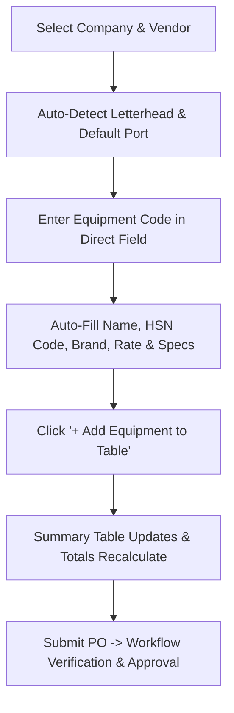

# Sarveksha ERP — Vendor Purchase Order Presentation Walkthrough

## Executive Summary

This walkthrough presents the end-to-end enhancements implemented in the **Vendor Purchase Order (VPO)** module for Sarveksha ERP. The updates focus on streamlining procurement workflows, eliminating confusing pop-up modals in favor of direct form inputs, ensuring complete equipment data (10+ items per PO with HSN codes), enabling automatic company letterhead detection with manual override options, enforcing multi-stage workflow security, and optimizing fixture data structures.

---

## 🌟 Key Features & Improvements

### 1. Direct Equipment Form Entry (No Pop-ups)
> [!NOTE]
> **Before**: Adding or modifying equipment items forced users into nested modal dialog pop-ups for every line item.  
> **Now**: Equipment details are entered directly into dedicated form fields on the main page.

- **Form Fields**: `Equipment Code`, `Equipment Name`, `HSN Code`, `Brand`, `Manufacturer`, `Quantity`, `Unit of Measure`, `Unit Rate`, `GST %`, and `Specification`.
- **Auto-Fill**: Selecting an `Equipment Code` automatically populates HSN code, brand, manufacturer, unit rate, GST percentage, and technical specifications.
- **Action Button**: Primary **`+ Add Equipment to Table`** button adds the item row to the summary table, recalculates grand totals, clears the entry fields for immediate next entry, and triggers a confirmation notification.
- **Summary Table**: Dedicated **Included Equipment Items Summary** table displays all 10 key columns in list view without requiring row dialogs.

---

### 2. Complete Sample Data (10+ Equipment Items with HSN Codes)
> [!TIP]
> All pre-generated Purchase Orders now feature at least **10 fully populated equipment line items**.

- **Equipment Master**: Created/updated 10 complete equipment master records (`EQ-03281` through `EQ-03290`).
- **Complete Attributes**: Every line item includes official HSN codes (e.g., `84742010`, `84741000`, `84137099`), brand, manufacturer, rates, GST calculations, and full specifications.
- **Verified Across All Workflow States**: Demo POs (`SRIPO-0001` through `SRIPO-0005`) across `Draft`, `Pending Verification`, `Pending Approval`, and `Approved` states contain complete 10-item summary tables.

---

### 3. Automatic Company Letter Head Detection
> [!IMPORTANT]
> Automatic letterhead detection matching company settings and country rules while keeping the Letter Head option selector fully visible on the form.

- **Auto-Detection Matrix**:
  - `Sarveksha Botswana` $\rightarrow$ `Botswana (Sarveksha Botswana)`
  - `Baani Minerals` $\rightarrow$ `Cameroon (Baani Minerals)`
  - `Sarveksha Mining SARL` $\rightarrow$ `Cameroon (Sarveksha Mining SARL)`
  - `Sarveksha BSTP SAS` $\rightarrow$ `Guinea (Sarveksha BSTP SAS)`
  - `Sarveksha SL Limited` / `Odhav` $\rightarrow$ `Sierra Leone (Sarveksha SL Limited)`
  - `Sarveksha Realty` $\rightarrow$ `India (Sarveksha Realty)`
- **Manual Override Option**: The `letter_head` dropdown is positioned right under the **Company** selector in the document header, enabling users to review or manually select any alternative letterhead.

---

### 4. Role-Based Workflow Security & Immutability
- **Audit Immutability**: `Verifier Comments` and `Approver Comments` are locked to their respective workflow stages (`Pending Verification` and `Pending Approval`), preventing cross-role edits.
- **Server-Side Guard**: Backend validation (`validate_audit_comments_edit_rights`) blocks unauthorized API modifications.
- **Document Locking**: Submitted/Approved POs lock critical header fields (`vendor`, `company`, `equipment`, `grand_total`) to prevent tampering after approval.

---

### 5. Repository & Fixture Size Optimization
> [!WARNING]
> Eliminating a 55 MB parent-child fixture duplication issue.

- **Root Cause Identified**: `Fiscal Year Company` was listed alongside `Fiscal Year` in `hooks.py`, creating a recursive duplication loop during `export-fixtures`.
- **Action Taken**: Deduplicated database tables, removed `Fiscal Year Company` from `hooks.py`, and re-exported clean fixtures.
- **Results**:
  - `fiscal_year.json`: **9.5 MB $\rightarrow$ 2.6 KB**
  - `fiscal_year_company.json` (45 MB): **Removed**
  - Total Fixture Directory: **58 MB $\rightarrow$ 3.2 MB** (~95% reduction).

---

## 📽️ Live Demonstration Flow

### Demonstration Steps:
1. **Open Purchase Order Form**:
   - Navigate to **Vendor Purchase Order** $\rightarrow$ Click **New**.
2. **Observe Header Auto-Detection**:
   - Select **Company**: `Sarveksha Botswana Proprietary Limited`.
   - Notice **Letter Head** instantly populates `Botswana (Sarveksha Botswana)` while remaining editable in the UI.
3. **Add Equipment Item Directly**:
   - In **Enter Equipment Details**, select `EQ-03281`.
   - Observe `Equipment Name`, `HSN Code` (`84742010`), `Brand` (`Metso Outotec`), `Unit Rate`, and `Specification` auto-fill directly into individual fields.
   - Click **`+ Add Equipment to Table`**.
   - Notice toast confirmation, summary table row addition, and automatic resetting of input fields.
4. **Inspect Existing Pre-Generated POs**:
   - Open `SRIPO-0001` or `SRIPO-0004`.
   - Verify all 10 equipment items are listed with complete HSN codes and breakdown totals.

---

## 📦 Repository & Branch Verification

- **Branch**: `umesh-test`
- **Remote**: `upstream` (`git@github.com:manikkDev/employee-erp-test.git`)
- **Status**: Clean, committed, and pushed up-to-date (`Commit: 2bc4117`).
