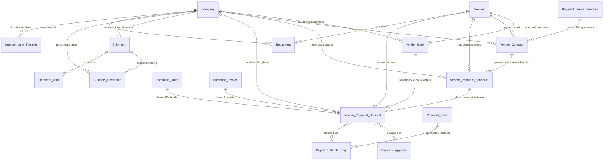

# Sarveksha Vendor Payment Tracking ERPNext Custom App

A production-ready custom Frappe application for tracking vendor contracts, schedules, clearings, shipments, bank details, and payments in ERPNext v16.

---

## 1. Architecture & Module Connectivity

The following Entity-Relationship Diagram (ERD) visualizes how all modules, standard Masters, and custom DocTypes are connected within the app:

---

## 2. Module Overview & Data Entry Flow

To use the system successfully, data must be entered in a logical order, starting with base masters, moving to operational agreements, and finishing with transactional execution.

### Phase 1: Core Setup (Base Masters)

#### 1. Company (Standard DocType)
*   **Purpose**: Represents the organizational entity executing transactions.
*   **How to Add**: 
    1. Go to **Configuration > Company**.
    2. Click **Add Company**.
    3. Enter the **Company Name**, **Abbreviation** (e.g., `SRIL`), **Default Currency** (e.g., `INR`), and **Country**.
    4. Save. Standard chart of accounts and default accounts will be auto-generated.

#### 2. Vendor (Custom DocType)
*   **Purpose**: Represents the third-party business entity providing equipment, services, or logistics.
*   **How to Add**:
    1. Go to **Configuration > Vendor** (or select it from the workspace).
    2. Click **Add Vendor**.
    3. Enter the **Vendor Name** (which determines the primary ID/name of the record).
    4. Select a **Vendor Group** (links to standard `Supplier Group`, e.g., `Local`, `Raw Material`).
    5. Enter tax and registration details: **PAN** and **GSTIN**.
    6. Provide primary contact information: **Contact Person**, **Contact Email**, and **Contact Phone**.
    7. Save the record.

#### 3. Vendor Bank (Custom DocType)
*   **Purpose**: Manages bank credentials for vendor payments. A vendor can have different default banks configured for different buyer companies.
*   **How to Add**:
    1. Go to **Configuration > Vendor Bank**.
    2. Click **Add Vendor Bank**.
    3. Select the **Vendor** and the **Company** this bank account is associated with.
    4. Provide the **Bank Name**, **Account Number**, and **IFSC Code** (or SWIFT / Routing Code).
    5. Choose the **Currency** (e.g., `INR`, `AED`, `SLE`) matching the account currency.
    6. Check **Is Default** if this is the primary bank for that company-vendor pair.
    7. Save.

---

### Phase 2: Agreements & Asset Tracking

#### 4. Vendor Contract (Custom DocType)
*   **Purpose**: Represents signed framework agreements or legal contracts outlining commercial values.
*   **How to Add**:
    1. Click **Vendor Contract** from the Quick Access shortcuts on the Workspace.
    2. Click **Add Vendor Contract**.
    3. Select the **Series** (autonaming e.g., `CON-.YYYY.-`), **Vendor**, and **Company**.
    4. Select **Status** (`Draft`, `Active`, `Expired`, `Terminated`).
    5. Provide **Start Date**, **End Date**, **Contract Amount**, and select a **Payment Terms Template** (e.g., `30 Days Credit`).
    6. Upload the physical PDF under **Contract Document** and add detailed text under the **Details** editor.
    7. Save and Submit.

#### 5. Equipment (Custom DocType)
*   **Purpose**: Tracks physical assets (excavators, dumpers, generators) procured from vendors.
*   **How to Add**:
    1. Navigate to **Logistics & Customs > Equipment**.
    2. Click **Add Equipment**.
    3. Select **Series** (`EQ-.YYYY.-`), enter **Equipment Name**, **Type**, **Model**, and **Serial Number**.
    4. Link to the buying **Company** and supplying **Vendor**.
    5. Add financial parameters: **Purchase Date**, **Purchase Cost**, and **Status** (`Available`, `In Use`, `Maintenance`, `Retired`).
    6. Save.

---

### Phase 3: Transactional Execution (Billing & Logistics)

#### 6. Vendor Payment Schedule (Custom DocType)
*   **Purpose**: Defines payment installments/milestones that are due under a contract.
*   **How to Add**:
    1. Go to **Vendor Payment Schedule** in the workspace.
    2. Click **Add Vendor Payment Schedule**.
    3. Select the **Vendor** and **Company**.
    4. Set the **Due Date** and **Amount** due for this specific milestone.
    5. Save. The system will track **Paid Amount** and **Outstanding Amount** automatically as requests are cleared.

#### 7. Vendor Payment Request (Custom DocType)
*   **Purpose**: The central transactional document representing a bill or payment application raised by a vendor.
*   **How to Add**:
    1. Click **Vendor Payment Request** from Quick Access.
    2. Select the **Vendor** and **Company**.
    3. Enter the invoice **Amount**.
    4. Link to standard **Purchase Invoice** and **Purchase Order** documents (if any).
    5. Select the **Vendor Bank** account (the beneficiary bank details will auto-populate).
    6. Link to the specific **Payment Schedule** milestone.
    7. Enter a **Request Date** and any **Remarks**.
    8. **Workflow Validation**: The system validates if the requested amount is within the limits of the schedule and contract, moving it from `Draft` -> `Finance Review` -> `Under Approval` -> `Approved` -> `Batch Pending` -> `Paid`.

#### 8. Payment Approval & Payment Batch (Custom DocTypes)
*   **Purpose**: Payment Requests are batched together, routed to managers for bulk sign-off, and grouped into execution batches for accounting.
*   **How to Add**:
    1. Set up a **Payment Approval** record, linking the relevant `Vendor Payment Request` items.
    2. Once approved, create a **Payment Batch**. 
    3. Add child entries under **Payment Batch Entry** linking approved requests.
    4. Execute standard journal entries to finalize the bank payout, updating status to `Paid`.

#### 9. Shipment & Customs Clearance (Custom DocTypes)
*   **Purpose**: Track international cargo transit and port logistics.
*   **How to Add**:
    1. Create a **Shipment** record. Set origin/destination countries, carrier (e.g. `Maersk`), tracking numbers, shipment/delivery dates, and link items under the **Shipment Item** child table.
    2. Create a **Customs Clearance** record. Link it to the **Shipment**, set the port of entry (e.g., `Port of Freetown`), declare duty/tax amounts, assign the clearance agent, and update status from `Pending` -> `Cleared` -> `Rejected`.

---

## 3. Step-by-Step Practical Workflow Example

Here is a quick walkthrough to execute a complete transaction cycle:

1.  **Configure Companies**: Go to **Company** master and create your regional hubs: `Sarveksha Realty and Inframine LLP` (for India) and `Sarveksha SL Limited` (for Sierra Leone).
2.  **Add your Vendors**: Go to **Vendor** master and create `Energy Compressor` (GSTIN: `24BMDPM2165A1ZM`, contact: Rajesh Goswami).
3.  **Add Bank Details**: Add a `Vendor Bank` record for `Energy Compressor` linked to `Sarveksha Realty and Inframine LLP`. Set Account No: `8949176817`, Bank: `KOTAK MAHINDRA BANK`, IFSC: `KKBK0002563`.
4.  **Create a Contract**: Open **Vendor Contract** and register a contract for ₹1,500,000 with `Energy Compressor`. Set the payment term template to `50% Advance` and attach the signed contract PDF.
5.  **Set Up the Payment Schedule**: Create a **Vendor Payment Schedule** record for ₹750,000 (the 50% milestone), due in 15 days.
6.  **Create a Payment Request**: When the vendor submits their advance invoice, create a **Vendor Payment Request** for ₹750,000. Link it to the schedule milestone created in Step 5 and the Bank details from Step 3. Save as Draft.
7.  **Approval & Payout**: Finance reviews the request, moves it through **Payment Approval**, bundles it into a **Payment Batch**, and processes the bank transfer. The schedule's outstanding amount reduces to zero.
